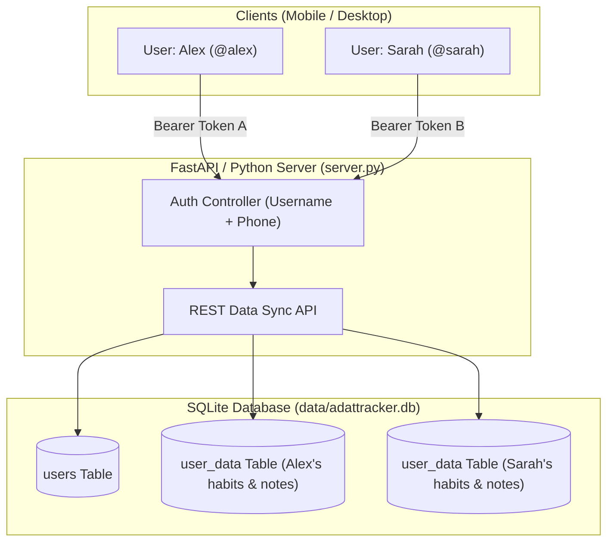

<div align="center">

# ⚡ AdatTracker Pro

**A Minimal, Self-Hostable, Multi-User Habit Tracker & Sticky Notes Dashboard.**
*Built for OLED dark-mode enthusiasts, homelab owners, and high performers.*

[](https://opensource.org/licenses/MIT)
[](https://www.python.org/)
[](https://fastapi.tiangolo.com)
[](https://www.docker.com/)
[](https://www.raspberrypi.com/)
[](https://www.sqlite.org/)

[Quick Start](#-quick-start) • [Features](#-features) • [Installation Options](#-installation-options) • [Multi-User Database](#-multi-user-architecture) • [Deployment](#-deployment-guides)

</div>

---

## 📸 Overview

AdatTracker Pro is a self-hostable web application that helps individuals and teams maintain discipline, build unbreakable daily streaks, and manage quick thoughts with sticky notes.

It runs with **zero external database dependencies** (SQLite embedded), uses less than **35 MB of RAM**, and can be self-hosted on a **Raspberry Pi, Proxmox LXC container, Oracle Cloud Free Tier VPS, or Docker**.

```
┌─────────────────────────────────────────────────────────────────────────────┐
│  AdatTracker Pro — FULLSCREEN DESKTOP DASHBOARD                            │
├─────────────────────────────────────────────────────────────────────────────┤
│  [🎯 Today: 100%]   [🔥 Top Streak: 18d]   [📈 Month: 94%]   [🏆 Score: 14.8] │
├─────────────────────────────────────────────────────────────────────────────┤
│  ⠿ Morning Meditation  [Mind]    [🔥14] [ 95%]   [✓][✓][✓][✓][✓][✓][✓][✓]  │
│  ⠿ Workout / Gym       [Health]  [🔥 8] [ 88%]   [✓][✓][✓][✓][ ][✓][✓][✓]  │
│  ⠿ Read 20 Pages       [Mind]    [🔥21] [100%]   [✓][✓][✓][✓][✓][✓][✓][✓]  │
│  ⠿ Deep Work Session   [Work]    [🔥 5] [ 80%]   [✓][✓][✓][✓][✓][ ][✓][✓]  │
└─────────────────────────────────────────────────────────────────────────────┘
```

---

## ✨ Features

- **📊 Monthly Habit Matrix**: Widescreen-optimized habit grid with smooth auto-scroll to today's date.
- **↕️ Drag & Drop Priority Reordering**: Minimalist `⠿` drag handles to slide and reorganize habits by priority on the fly.
- **🏆 Proportional Scoring Engine**: Accurate daily scoring ($\text{Completed Habits} / \text{Total Habits}$) and lifetime consistency points.
- **📌 Interactive Sticky Notes**: Multi-colored post-it notes with Pin to Top (📌), clipboard copy (📋), search, and live editing.
- **🔐 Multi-User Authentication**: Simple `Username` + `Phone Number` login & enrollment with completely isolated user database profiles.
- **💡 2-Second Interactive Feature Guide**: Hover over any card for 2 seconds to view instant context, keyboard tips, and usage guides.
- **⚡ Dual-Engine Backend**: Runs ultra-fast with **FastAPI**, and seamlessly falls back to the **Python 3 Standard Library** (zero dependencies required).
- **📱 Fully Responsive**: Built for mobile browsers, tablets, and 4K desktop widescreen displays.

---

## ⚡ Quick Start

### 1. One-Line Universal Install (Linux / Raspberry Pi / Proxmox)

Run this single command on your server to install and launch AdatTracker as a 24/7 background service:

```bash
curl -sSL https://raw.githubusercontent.com/12thpassengineer/HabitTracker/main/install.sh | bash
```

---

### 2. Docker Compose (1-Command Startup)

```bash
# Clone the repository
git clone https://github.com/12thpassengineer/HabitTracker.git
cd HabitTracker

# Launch container
docker compose up -d
```
Access the application at `http://localhost:8000`.

---

### 3. Native Python (Zero External Dependencies)

Because AdatTracker contains a built-in standard library fallback, you can run it anywhere with pure Python 3:

```bash
git clone https://github.com/12thpassengineer/HabitTracker.git
cd HabitTracker

# Run directly (uses built-in SQLite & standard library HTTP engine)
python3 server.py
```

---

## 🔐 Multi-User Architecture

AdatTracker Pro separates user data at the database level:



- **Login**: Verifies that the entered `username` matches the stored `phone number`.
- **Enrollment**: New users click **"Enroll New User"** to create a fresh profile.
- **Storage**: All user profiles, habits, and notes are saved to a single file at `./data/adattracker.db`.

---

## 🌐 Deployment Guides

### 🍓 Raspberry Pi (Raspberry Pi OS / DietPi)

```bash
mkdir -p ~/habit-tracker && cd ~/habit-tracker
curl -sSL https://raw.githubusercontent.com/12thpassengineer/HabitTracker/main/install.sh | bash
```
Access from any phone or laptop on your home Wi-Fi: `http://raspberrypi.local:8000`.

---

### 📦 Proxmox LXC Container (Debian / Ubuntu)

1. Create a lightweight LXC (512 MB RAM, 1 vCPU).
2. Inside the LXC console, run:
```bash
apt update && apt install -y curl
curl -sSL https://raw.githubusercontent.com/12thpassengineer/HabitTracker/main/install.sh | bash
```
3. Access via `http://<lxc-container-ip>:8000`.

---

### ☁️ Oracle Cloud Always-Free VPS

1. Open port `8000` in your **Oracle Cloud VCN Security List** (Ingress Rules: CIDR `0.0.0.0/0`, TCP Port `8000`).
2. SSH into your Oracle Cloud VM and run:
```bash
sudo iptables -I INPUT 6 -m state --state NEW -p tcp --dport 8000 -j ACCEPT
curl -sSL https://raw.githubusercontent.com/12thpassengineer/HabitTracker/main/install.sh | bash
```
3. Access via `http://<your-oracle-public-ip>:8000`.

---

## ⚙️ Configuration & Environment Variables

| Variable | Default | Description |
|---|---|---|
| `PORT` | `8000` | Port for the web server to listen on |
| `HOST` | `0.0.0.0` | Network interface binding |

---

## 💾 Backup & Restore

All habits, notes, and user accounts live in a single SQLite file:
```bash
# Backup
cp data/adattracker.db ~/backup_adattracker_$(date +%F).db

# Restore
cp ~/backup_adattracker_*.db data/adattracker.db
```

---

## 📄 License

This project is licensed under the **MIT License** — see the [LICENSE](LICENSE) file for details.
